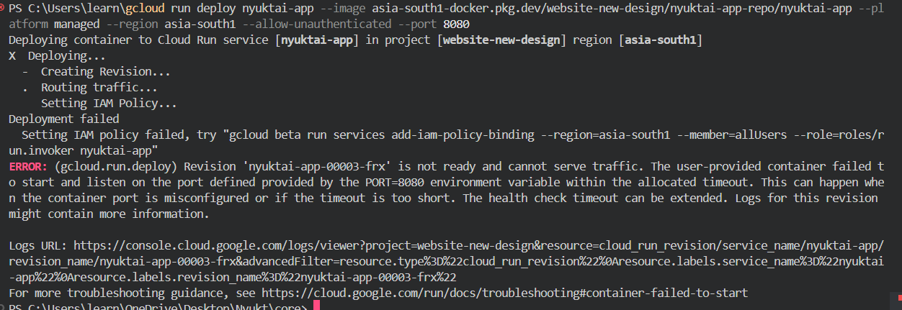
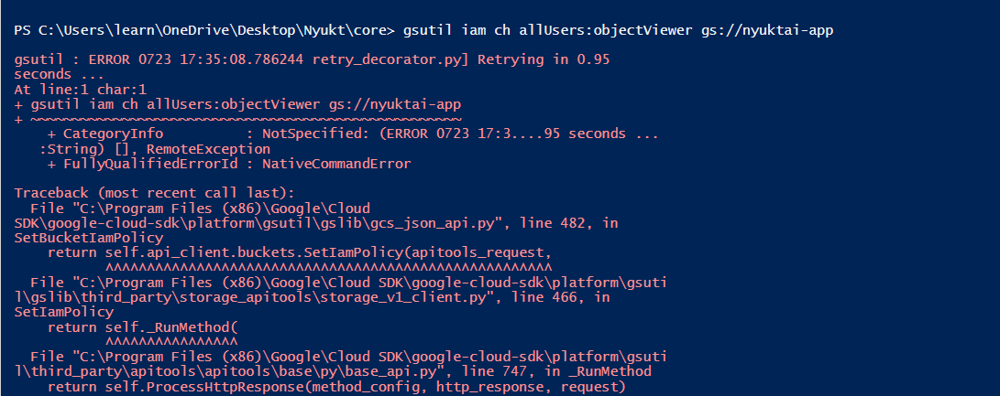

-npm install aos


- gcloud auth login
- website-new-design
- PS C:\Users\learn\OneDrive\Desktop\Nyukt>  gcloud config set project website-new-design
- PS C:\Users\learn\OneDrive\Desktop\Nyukt> gcloud run deploy nyuktai


- gsutil web set -m index.html gs://nyuktai-app
```
❌ PreconditionException: 412 One or more users named in the policy do not belong to a permitted customer.

That means your org restricts using allUsers in IAM policies, so you can’t make a Cloud Storage bucket or Cloud Run service public by default.

- The user-provided container failed to start and listen on the port defined by the PORT=8080 environment variable
```



If you don’t want to manage a server or Docker at all, alternatives are:

✅ Firebase Hosting

✅ Vercel / Netlify

✅ Cloud Storage + Load Balancer